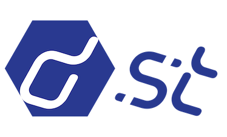

> A distributed key-value store with table concepts.

- Redis-like data structure
- Table concept based on KV Store
- High available because it's distributed
- Easy to use client
- Strong ecosystem for Web application

[GitHub](https://github.com/distkv-project/distkv)
[Get Started](#quick-start)
